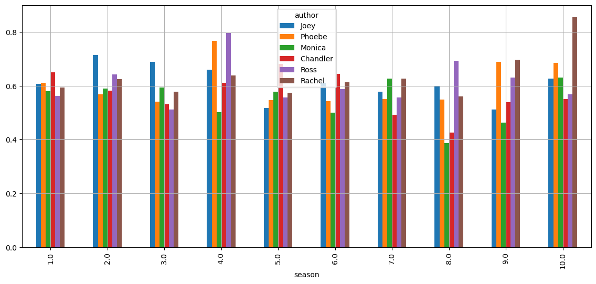

## Executive Summary

This project explores the intricate relationships and emotional dynamics of the beloved characters from the iconic sitcom F.R.I.E.N.D.S. By leveraging advanced data mining techniques, we analyzed quotes from the show to uncover patterns of interaction, sentiment, and association among the six main characters. The analysis provides a unique perspective on the ensemble nature of the show and the emotional tapestry that binds its characters together. Key highlights include:

- **Missing Data Handling**: Addressed inconsistencies in sentiment dictionaries using cosine similarity to estimate and fill missing values, ensuring a robust foundation for analysis.

- **Sentiment Analysis and Clustering**: Quantified emotional tones of character quotes using sentiment lexicons, followed by PCA and k-means clustering to group characters based on emotional expressions, revealing distinct sentiment profiles.

- **Character Relationships via Association Rules**: Treated conversations as transactional data to uncover strong relationships between characters. Key dynamics include Chandler and Monica's romantic bond, Joey's role as a social connector, and the frequent ensemble appearances of all six main characters.

The findings highlight Joey Tribbiani as a central figure with strong associations across the group, reflecting his role as comic relief and a unifying presence. Romantic arcs like Ross and Rachel, and Monica and Chandler, are underscored by high mutual association. Phoebe Buffay's unique personality is evident in her relatively distinct interactions.

This project celebrates the enduring appeal of F.R.I.E.N.D.S while showcasing the power of data mining to uncover hidden patterns in cultural phenomena. The insights gained offer a deeper appreciation of the show's storytelling and character development, making it a valuable case study for fans and data enthusiasts alike.

\newpage

## Introduction

F.R.I.E.N.D.S is a popular sitcom that aired from 1994 to 2004. It follows the lives of six friends living in Manhattan, New York City. The show has become a cultural phenomenon and has a massive fan base around the world. In this report, we analyzed quotes from the show using data mining techniques to gain insights into the characters and their relationships.

The Data description seciton The dataset we used for this analysis contains quotes from the show, along with information about the characters who said them. The dataset was obtained from [Kaggle](https://www.kaggle.com/datasets/rtatman/friends-quotes). We also used sentiment analysis datasets from [Kaggle](https://www.kaggle.com/datasets/ekrembayar/sentiment-lexicons-for-text-mining) to analyze the sentiment of the quotes.

Major achievements of this project include:

- **Missing data handling on sentiment analysis datasets**: the sentiment dictionaries are mismatched with each other. We used cosine similarity to fill the missing sentiment values.
- **Sentiment analysis based PCA and k-means clustering**: we used the sentiment dictionaries to analyze the sentiment of the quotes. Then using PCA and k-means clustering, we clustered the characters based on their sentiment.
- **Relationship analysis based on association rules**: we used association rules to analyze the relationships between the characters based on their quotes.

## Data description

We are using five datasets in this project:

- `data/friends_quotes.csv`: sourced from [Kaggle link](https://www.kaggle.com/datasets/ryanstonebraker/friends-transcript)
  - `author`: The character who said the quote
  - `episode_number`: episode number
  - `episode_title`: episode title
  - `quote`: the quote itself
  - `quote_order`: the order of the quote in the episode
  - `season`: the season number

Sentiment analysis datasets: [Kaggle link](https://www.kaggle.com/datasets/ekrembayar/sentiment-lexicons-for-text-mining)

- `data/afinn.csv`: AFINN-111 sentiment analysis word list
  - `word`: the word
  - `value`: range from -5 (very negative) to +5 (very positive)
- `data/bing.csv`: Bing Liu's opinion lexicon
  - `word`: the word
  - `sentiment`: range from -1 (negative) to +1 (positive)
- `data/loughran.csv`: Loughran-McDonald sentiment word list
  - `word`: the word
  - `sentiment`: negative and positive
- `data/nrc.csv`: NRC Emotion Lexicon
  - `word`: the word
  - `sentiment`: the sentiment (e.g. anger, anticipation, disgust, fear, joy, sadness, surprise, trust)

### Acknowledgements

The raw transcripts of every episode were originally scraped from here: [Friends quotes](https://fangj.github.io/friends/).
Additional work cleaning up the data and removing invalid rows was done by [Jorge Nachtigall](https://www.kaggle.com/jorgenachtigall)

## Missing data handling on sentiment analysis datasets

### Loading and Cleaning the Datasets

We loaded four major sentiment lexicons: AFINN, Bing Liu’s Opinion Lexicon, the NRC Emotion Lexicon, and the Loughran-McDonald Financial Sentiment Dictionary. Each of these datasets contained sentiment information for various English words. We merged the four lexicons into a single DataFrame. Some words appeared only in certain dictionaries. As a result, the unified DataFrame had multiple columns: `word`, `value` (AFINN score), `sentiment` (Loughran sentiment), `sentiment_x` (Bing sentiment), and `sentiment_y` (NRC emotional categories).

### Filling Missing Data Using GloVe Embeddings

To handle all missing fields — `value`, `sentiment_x`, and `sentiment_y` — we adopted a unified strategy based on semantic similarity using pre-trained GloVe word embeddings. For missing `value` scores, we first loaded the GloVe 6B 200-dimensional embeddings, and for missing `sentiment_x` and `sentiment_y`, we used GloVe Twitter 27B embeddings, as these are more suited for emotion and opinion words found in informal text.

For each missing entry, we first checked whether the word’s GloVe embedding was available. If it was, we calculated its similarity to all words that had known values or sentiment labels, using **cosine similarity** — a metric that measures the cosine of the angle between two vectors and captures semantic closeness regardless of word frequency or word form. Specifically, the cosine similarity between two vectors \( A \) and \( B \) is given by:

`cosine_similarity(A, B) = (A · B) / (||A|| × ||B||)`

where \( A \cdot B \) is the dot product, and \( ||A|| \) and \( ||B|| \) are their magnitudes.

Using this method, for each missing `value`, we found the closest word and assigned its value score; for each missing `sentiment_x`, we assigned the most similar known sentiment label; and for each missing `sentiment_y`, which could have multiple emotions, we assigned the relevant list of emotion labels from the most semantically similar known word. After completing the imputations, we rounded the filled `value` scores to the nearest integer, clipped them within [-5, 5] for consistency, and handled the multi-label structure in `sentiment_y` carefully by later exploding it for analysis.

### Deduplication and Final Cleaning

After imputing missing data, we cleaned the dataset further by removing duplicate words, ensuring that each word appeared only once with its enriched sentiment information. This made the dataset structured, easy to handle, and ready for visualization and further use.

### Exploratory Data Analysis and Visualization

#### Value Distribution Across Sentiments (Loughran)

We analyzed the distribution of AFINN `value` scores across different Loughran sentiment labels. Positive sentiments had positive values, and negative or uncertainty-related sentiments had negative values.

#### Value Distribution Across Sentiment_X (Bing)

We visualized how the AFINN `value` scores are distributed across positive and negative sentiment labels from Bing. There was a clear separation between positive and negative classes, validating the semantic consistency.

#### Sentiment vs Sentiment_X Relationship

We compared the categorical relationship between Loughran sentiments and Bing's positive/negative classification. As expected, positive Loughran words mostly mapped to Bing positive, and negative/uncertain terms mapped to Bing negative.

#### Value Distribution Across Sentiment_Y (NRC Emotions)

The boxplot showed that negative emotions (fear, anger, sadness) had lower `value` scores, and positive emotions (joy, trust, anticipation) had higher `value` scores, confirming correct imputation.

#### Sentiment_Y vs Sentiment_X Alignment

Finally, the comparison of NRC emotional sentiments (`sentiment_y`) and Bing polarity (`sentiment_x`) revealed logical associations. Negative emotions aligned with negative sentiment, and positive emotions aligned with positive sentiment.

## Sentiment analysis

### Sentiment Feature Construction

We constructed sentiment features using four different sentiment lexicons:

- AFINN: assigns scores between -5 to 5.
- Bing: assigns positive or negative labels.
- Loughran: financial sentiment dictionary.
- NRC: associates words with various emotions.

For each quote, we tokenized the text and matched the words with each sentiment dictionary. Then, the sentiment scores were calculated as the average occurrence across matched words.

Specifically:

- For AFINN:

$$
\text{AFINN\_score} = \frac{\sum \text{AFINN}(word)}{\text{number of matched words}}
$$

- For Bing, we computed the proportion of positive and negative classifications:

$$
\text{Bing\_positive\_proportion} = \frac{\text{number of positive words}}{\text{total number of matched words}}
$$

$$
\text{Bing\_negative\_proportion} = \frac{\text{number of negative words}}{\text{total number of matched words}}
$$

The sum of negative proportion and positive proportion for Bing categories equals 1.

- For Loughran, we computed the proportion of each classification category:

$$
\text{Category\_proportion} = \frac{\text{number of words classified into category}}{\text{total number of matched words}}
$$

where categories are: constraining, litigious, negative, positive, superfluous, and uncertainty. The sum of proportions for Loughran categories equals 1.

- For NRC, the score for each emotion (anger, joy, trust, etc.) was calculated as:

$$
\text{Category\_proportion} = \frac{\text{number of words classified into category}}{\text{total number of matched words}}
$$

The sum of proportions for NRC emotions equals 1.

If no words matched in a quote for a dictionary, the score was set to 0.

---

### Sentiment Analysis Based on AFINN Quote Scores

We analyzed AFINN sentiment scores across seasons for each character, focusing on:

- Average scores (Bar and Line Charts)
- Standard deviation (Bar and Line Charts)

#### 1. Average AFINN Score Across Seasons

>

>

Observations:

- Rachel shows a noticeable upward trend starting from Season 6, peaking in Season 10. This coincides with her professional success at Ralph Lauren and her decision to stay in New York with Ross and Emma in the finale.
- Phoebe's scores steadily increase after Season 5, aligning with her relationship with Mike Hannigan and their eventual marriage.
- Monica's average sentiment dips around Seasons 7 and 8, corresponding with emotionally intense arcs such as infertility struggles and the adoption storyline.
- Ross fluctuates across seasons, reflecting his unstable relationships, including divorces from Carol and Emily.
- Chandler and Joey display relatively consistent scores, reflecting Chandler's sarcastic yet supportive nature and Joey's role as comic relief.

#### 2. Standard Deviation of AFINN Score Across Seasons

>

>

Observations:

- Monica shows the highest volatility, especially in Seasons 2 and 9. These periods align with her breakup with Richard and the adoption process with Chandler.
- Rachel's variability increases in the later seasons, particularly in Season 10, reflecting her decision between Paris and Ross.
- Ross maintains a moderate but consistent level of sentiment variability, associated with his frequent romantic challenges.
- Chandler and Joey remain emotionally stable, matching Chandler's reliable humor and Joey's easygoing personality.

---

### Summary

- Rachel and Phoebe become more positive and emotionally expressive over time.
- Monica shows the most emotional fluctuation, consistent with her life transitions.
- Ross's sentiment swings reflect his chaotic romantic journey.
- Chandler and Joey remain steady emotionally.

---

### Sentiment Distribution Based on Bing Liu's Dictionary

>

Observations:

- Rachel and Joey exhibit the highest positive sentiment. Rachel's emotional arc, from a runaway bride to a successful career woman, mirrors her rising positivity. Joey's cheerful and naive nature adds to his high positivity.
- Chandler has the highest negative sentiment, consistent with his sarcastic humor and occasional struggles with self-esteem.
- Phoebe balances positive energy with occasional dark humor, often referencing her traumatic past.
- Monica's mix of affection and competitiveness results in a balanced sentiment profile.
- Ross shows more positivity than expected, possibly due to his earnest attempts at connection despite his relationship failures.

---

### Summary

- Joey and Rachel reflect consistent optimism.
- Chandler stands out for emotional negativity.
- Phoebe, Monica, and Ross show a more balanced emotional profile.

---

### Sentiment Distribution Based on Loughran-McDonald Dictionary

>

Observations:

Observations:

- Negative sentiment dominates overall, especially for Ross, reflecting his personal struggles.
- Joey and Phoebe lead in positive sentiment, consistent with their cheerful personas.
- Uncertainty is notable for Monica and Phoebe, reflecting Monica's perfectionism and Phoebe's unpredictability.
- Chandler and Ross show slightly higher constraining and litigious tones, fitting their involvement in structured and stressful situations.
- Rachel shows a higher superfluous proportion, consistent with her expressive and emotional communication style.

---

### Summary

- Ross shows more negativity and uncertainty.
- Joey and Phoebe show strong positivity and spontaneity.
- Monica and Chandler reflect pressure and structure.
- Rachel shows heightened emotional expression.

---

### Sentiment Distribution Based on NRC Emotion Lexicon

>

Observations:

- Positive sentiment is high across all characters, with Ross and Rachel leading.
- Joey and Phoebe show strong joy and surprise, consistent with their lively and spontaneous behavior.
- Chandler shows higher trust and anticipation, reflecting his emotional growth, especially through his relationship with Monica.
- Monica and Ross show more sadness and fear, reflecting deeper emotional conflicts.
- Anger and disgust are generally low, slightly higher in Monica and Chandler during tense scenes.
- Surprise and anticipation are evenly distributed, showing the dynamic storytelling style of the series.

---

### Summary

- Rachel, Ross, and Phoebe show broad emotional ranges tied to personal growth.
- Joey and Phoebe express strong joy and spontaneity.
- Monica and Ross reveal deeper emotional tensions.
- Friends presents a nuanced portrayal of emotions beyond its comedic surface.

---
### K-Means Clustering on Merged Sentiment Features

To explore underlying sentiment patterns across characters, we applied K-Means clustering to a feature set constructed by merging sentiment outputs from all four dictionaries: AFINN, Bing Liu, Loughran-McDonald, and NRC Emotion Lexicon.

Each row in the dataset represents a character, and each column corresponds to a normalized sentiment or emotion score. The final feature set contains 20 dimensions:

- AFINN score
- NRC emotions: negative, sadness, fear, disgust, anticipation, positive, anger, trust, surprise, joy
- Bing Liu: positive_y, negative_y
- Loughran-McDonald: negative, positive, uncertainty, constraining, litigious, superfluous

We standardized the features and applied K-Means clustering with \( k = 4 \), grouping the main characters based on their overall sentiment similarity.

> Character Cluster Assignments:

| Character | Cluster |
|-----------|---------|
| Joey      | 3       |
| Phoebe    | 3       |
| Monica    | 1       |
| Chandler  | 1       |
| Ross      | 2       |
| Rachel    | 0       |

---

#### Cluster Interpretation

- Cluster 0: Rachel

  Rachel forms her own distinct cluster. Her emotional profile is characterized by:

  - A high AFINN sentiment score
  - Strong scores in NRC categories such as joy, trust, and anticipation
  - Moderate emotional variability
  - Relatively high use of expressive language, as indicated by her superfluous score in the Loughran-McDonald dictionary

  This is consistent with her development throughout the series—from a dependent character to an independent professional with emotional depth.

- Cluster 1: Monica and Chandler

  Monica and Chandler are grouped together, which reflects:

  - Emotionally balanced but intense profiles
  - Slightly higher levels of anger, fear, and legalistic or constrained language
  - Lower overall joy compared to other main characters

  This cluster highlights the emotional challenges they face together, including infertility and adoption, and the presence of stress and structure in their personalities.

- Cluster 2: Ross

  Ross is placed in a separate cluster, primarily due to:

  - High negative sentiment across multiple lexicons
  - Elevated sadness, fear, and uncertainty scores
  - Moderate levels of joy and trust

  These characteristics align with his emotionally unstable narrative, including divorces, jealousy, and strained relationships.

- Cluster 3: Joey and Phoebe

  Joey and Phoebe are clustered together due to:

  - High levels of joy, surprise, and positivity
  - Consistently low levels of negative emotions such as anger, fear, and sadness

  Both characters are light-hearted and emotionally open. Their optimistic and spontaneous behavior is consistently reflected in their sentiment scores.

---

### Summary

The clustering results reveal distinct emotional profiles among the main characters in Friends:

- Rachel is emotionally expressive and distinct from the others.
- Monica and Chandler are grouped due to their shared emotional intensity and structured communication styles.
- Ross forms a separate group due to his higher emotional variability and negative sentiment.
- Joey and Phoebe share a strongly positive and consistent emotional profile.

These groupings not only reflect patterns identified through sentiment features, but also align with the emotional trajectories established through the show's narrative.

---
### PCA Visualization of Character Clustering

To visualize emotional similarities among characters, we applied principal component analysis (PCA) to reduce the 20-dimensional sentiment feature space into two principal components.

The features used included combined outputs from the AFINN, Bing Liu, Loughran-McDonald, and NRC dictionaries. PCA was performed on both the main characters and a group of notable supporting roles, including:

- Main characters: Joey, Phoebe, Monica, Chandler, Ross, Rachel  
- Supporting roles: Susan, Carol, Frank, Janice, Richard, David, Mike, Tag, Gunther, Mr. Geller, Mrs. Geller

>

---

#### Interpretation of the PCA Plot

The PCA plot provides a spatial representation of emotional similarity. Characters positioned close together have similar sentiment profiles across the four dictionaries.

1. Main character groupings

- Rachel, Monica, Chandler, Phoebe, Joey, and Ross are clustered near the center of the plot.  
  This reflects a balanced emotional tone shared among the main characters, likely a result of their frequent interactions and shared narrative arcs.  
  Monica and Chandler show slight deviation from others, possibly reflecting the emotional complexity of their relationship, including experiences such as infertility and adoption.

2. Joey and Phoebe: close emotional alignment

- Joey and Phoebe appear very close on the plot, which supports the results from K-means clustering.  
  Both are characterized by high positivity, spontaneity, and light-heartedness, often providing comic relief throughout the series.

3. Ross: slight separation

- Ross is positioned slightly away from the core cluster.  
  This corresponds with his fluctuating emotional tone, driven by multiple failed relationships, episodes of jealousy, and frequent interpersonal conflict.  
  His variability is also supported by his relatively high standard deviation in AFINN scores.

---

4. Supporting characters and their emotional positioning

- Carol and Susan are more distant from the core group.  
  Susan’s position may reflect her direct and sarcastic tone, often in contrast to Ross.  
  Carol, though less emotionally extreme, is involved in conflict-heavy storylines such as co-parenting.
  
- Mr. and Mrs. Geller appear further away from the main group, which aligns with their detached and judgmental roles as parents, as well as their limited emotional presence in the show.

- Mike, David, and Tag—romantic interests of Phoebe and Rachel—are distributed moderately close to the core group.  
  Mike is positioned closer, which is consistent with his long-term involvement with Phoebe.  
  David and Tag, having shorter appearances and lighter emotional arcs, appear more peripheral.

- Gunther is positioned closer to Rachel and Ross, reflecting his continued emotional connection to Rachel and his consistent presence at Central Perk.

- Janice and Frank are placed higher on the plot.  
  Janice’s heightened emotional expression and distinctive speaking style may contribute to her separation.  
  Frank shares some emotional similarity with Phoebe but plays a less central narrative role.

---

### Summary

The PCA visualization reinforces previous clustering results:

- The main characters are grouped closely, reflecting shared emotional tone and structure.
- Joey and Phoebe demonstrate strong emotional alignment, particularly in positive sentiment.
- Ross shows greater variability, consistent with his complex personal narrative.
- Supporting characters are more dispersed, and their distance reflects both narrative relevance and emotional distinction.

---

### Conclusion

This study conducted sentiment analysis using four lexicons—AFINN, Bing Liu, Loughran-McDonald, and NRC—and applied K-means clustering and principal component analysis to examine emotional profiles in the television series Friends. The results show that the six main characters maintain a highly correlated emotional structure across different sentiment dimensions, as evidenced by their proximity in both clustering and PCA visualization. Despite narrative differences in individual arcs, their emotional distributions remain consistently aligned, supporting the idea that their character development was intentionally designed to maintain group cohesion. This provides a quantitative basis for understanding how emotional dynamics contribute to the show's long-standing audience engagement and cohesive group identity.

## Relationship analysis based on association rules

If two characters have more converstations, they are more likely to have a closer relationship. If we could separate the quotes into "conversations", then we would be able to figure out who are in this conversation. Treat each conversation as an observation, and each character is a item. We can use association rules to find who have stronger association with other characters.

The steps are as follows:

1. Figure out the conversation boundaries.
2. Create a transaction table: each row is a conversation, and the value is a set of characters appeared in this conversation.
3. Use association rules to find the relationships between characters.

### Figure out the conversation boundaries

We tested several approaches to figure out the conversation boundaries. First, we tried to use a fixed number of quotes as a conversation, typical length of a conversation for TV shows is around 15-30 quotes. However, this approach is not very accurate, as the number of quotes in a conversation can vary significantly. Second, we tried to use existing large language models such as ChatGPT to figure out the conversation boundaries, we still found that the results are way off. The model is not able to figure out the conversation boundaries accurately, as it is not trained on this specific task.

We finally decided to use "greetings" to determine the start of a conversation. The conversation is defined in:

0. Divide the quotes into episodes.
1. If a quote contains a greeting, then it is the start of a conversation.
2. For the following 5 quotes, if greetings appear again, then it is remaining in the same conversation.
3. Conversation continues until the next greeting appears.

> Greetings include: hello, hi, howdy, yo, sup, morning, good morning. We also tried to use "hey", "greetings", "what's up", but they appear too often and not at the beginning of a conversation.

This approach is not perfect, since some conversations may not have greetings, it may result a low volume of conversations. It could further result more characters in a single conversation, raising the chance of false positives (Higher support and confidence level). However, our goal is to figure out who have the "strongest association" with other characters, it is a relative measure, absolute accuracy is not required. We believe this approach is good enough to figure out the relationships between characters, and indeed the results are quite interesting.

Here is a sample of the conversation, and the characters in this conversation:

| Conversation | Characters                                                                |
|-------|----------------------------------------------------------------------|
| 0     | [chandler, joey, monica, phoebe, rachel, ross]                       |
| 1     | [chandler, joey, monica, phoebe, ross]                               |
| 2     | [chandler, joey, monica, paul, phoebe, rachel,...                    |
| 3     | [chandler, joey, monica, paul, phoebe, rachel,...                    |
| 4     | [chandler, joey, monica, on, paul, priest, rac...                    |

### The association rules

We used the apriori algorithm to find the association rules between characters. The minimum support are set to 0.05.

**Most frequent characters**:

|   | support  | itemsets         |
|---|----------|------------------|
| 0 | 0.785816 | (chandler)       |
| 5 | 0.785816 | (rachel)         |
| 6 | 0.785816 | (ross)           |
| 1 | 0.764539 | (joey)           |
| 2 | 0.761702 | (monica)         |
| 4 | 0.727660 | (phoebe)         |
| 8 | 0.680142 | (chandler, monica)|
| 7 | 0.669504 | (chandler, joey) |
| 22| 0.663121 | (rachel, ross)   |
| 11| 0.661702 | (chandler, ross) |

The results show that Chandler, Rachel, and Ross are the most frequently appearing characters in conversations. Also the all six main characters (Monica, Joey, Chandler, Ross, Rachel, and Phoebe) are frequently appearing together in conversations. This obviously reflects the ensemble nature of the show.

### Single antecedent

We filtered the results to show only the rules with a single antecedent. The results are as follows:

- **Joey Tribbiani**:

| antecedents | consequents | support  | confidence | lift     |
|-------------|-------------|----------|------------|----------|
| (joey)      | (chandler)  | 0.669504 | 0.875696   | 1.114378 |
| (joey)      | (ross)      | 0.641844 | 0.839518   | 1.068339 |
| (joey)      | (rachel)    | 0.636170 | 0.832096   | 1.058895 |
| (joey)      | (monica)    | 0.631915 | 0.826531   | 1.085110 |
| (joey)      | (phoebe)    | 0.615603 | 0.805195   | 1.106554 |

- **Ross Geller**:

| antecedents | consequents |  support  | confidence |   lift   |
|:-----------:|:-----------:|:---------:|:----------:|:--------:|
|   (ross)    |   (rachel)  | 0.663121  |  0.843863  | 1.073869 |
|   (ross)    | (chandler)  | 0.661702  |  0.842058  | 1.071572 |
|   (ross)    |    (joey)   | 0.641844  |  0.816787  | 1.068339 |
|   (ross)    |  (monica)   | 0.634043  |  0.806859  | 1.059284 |
|   (ross)    |  (phoebe)   | 0.613475  |  0.780686  | 1.072872 |

- **Rachel Green**:

| antecedents | consequents | support  | confidence | lift     |
|-------------|-------------|----------|------------|----------|
| (rachel)    | (ross)      | 0.663121 | 0.843863   | 1.073869 |
| (rachel)    | (monica)    | 0.643262 | 0.818592   | 1.074688 |
| (rachel)    | (chandler)  | 0.642553 | 0.817690   | 1.040562 |
| (rachel)    | (joey)      | 0.636170 | 0.809567   | 1.058895 |
| (rachel)    | (phoebe)    | 0.617021 | 0.785199   | 1.079074 |

- **Monica Geller**:

| antecedents | consequents | support  | confidence | lift     |
|-------------|-------------|----------|------------|----------|
| (monica)    | (chandler)  | 0.680142 | 0.892924   | 1.136302 |
| (monica)    | (rachel)    | 0.643262 | 0.844507   | 1.074688 |
| (monica)    | (ross)      | 0.634043 | 0.832402   | 1.059284 |
| (monica)    | (joey)      | 0.631915 | 0.829609   | 1.085110 |
| (monica)    | (phoebe)    | 0.630496 | 0.827747   | 1.137547 |

- **Chandler Bing**:

| antecedents | consequents | support  | confidence | lift     |
|-------------|-------------|----------|------------|----------|
| (chandler)  | (monica)    | 0.680142 | 0.865523   | 1.136302 |
| (chandler)  | (joey)      | 0.669504 | 0.851986   | 1.114378 |
| (chandler)  | (ross)      | 0.661702 | 0.842058   | 1.071572 |
| (chandler)  | (rachel)    | 0.642553 | 0.817690   | 1.040562 |
| (chandler)  | (phoebe)    | 0.627660 | 0.798736   | 1.097679 |

- **Phoebe Buffay**:

| antecedents | consequents | support  | confidence | lift     |
|-------------|-------------|----------|------------|----------|
| (phoebe)    | (monica)    | 0.630496 | 0.866472   | 1.137547 |
| (phoebe)    | (chandler)  | 0.627660 | 0.862573   | 1.097679 |
| (phoebe)    | (rachel)    | 0.617021 | 0.847953   | 1.079074 |
| (phoebe)    | (joey)      | 0.615603 | 0.846004   | 1.106554 |
| (phoebe)    | (ross)      | 0.613475 | 0.843080   | 1.072872 |

The results are quite interesting. For example, we can see that:

- Joey has a strongest association with Chandler, it highlights their close friendship and frequent interactions.
- Both romantice relationships (Ross and Rachel, Monica and Chandler) have a strong association with each other. This reflects the romantic arcs in the show.
- Phoebe appears at the last place for all other characters, which is quite interesting. It may reflect her unique personality and the fact that she often stands out from the group.
- Joey has the highest average confidence level, which mean he probably has the most conversations with other characters. This is consistent with his character as the comic relief and the one who often interacts with others.

### Other interesting rules

For Chandler and Monica couples, we could clearly see that they have a strong association with Joey, again Joey is the one who ofter appears in their conversations. This is consistent with the show, as Joey is often the one who brings them together and is involved in their relationship.

| antecedents         | consequents | support  | confidence | lift     |
|---------------------|-------------|----------|------------|----------|
| (chandler, monica)  | (joey)      | 0.595035 | 0.874870   | 1.144310 |
| (chandler, monica)  | (ross)      | 0.587234 | 0.863399   | 1.098730 |
| (chandler, monica)  | (rachel)    | 0.581560 | 0.855057   | 1.088114 |
| (chandler, monica)  | (phoebe)    | 0.578723 | 0.850886   | 1.169347 |

## Conclusion

Balabala
